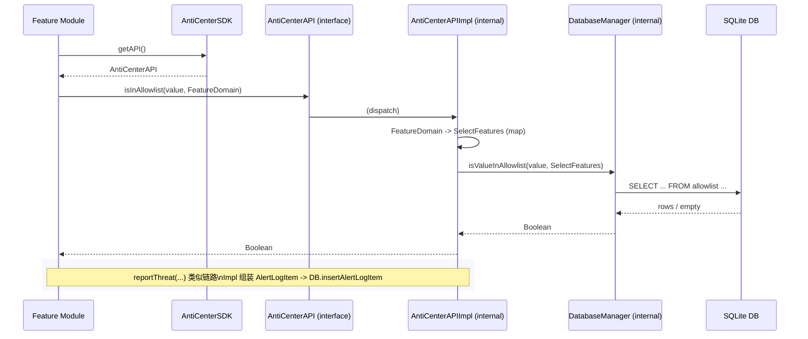
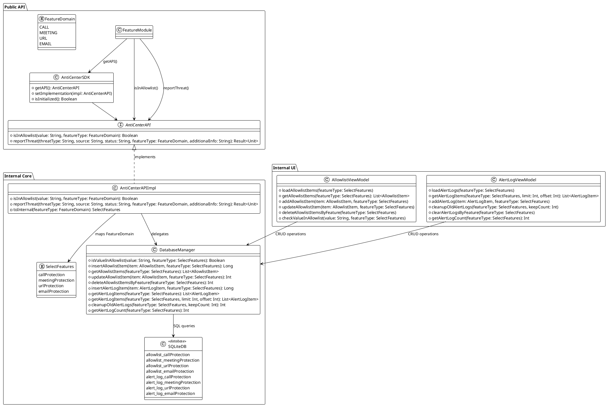

# Internal Database API

Shared contract for feature modules to access allowlist and report threats.

## Shared Files

| File | Purpose |
|------|---------|
| `AntiCenterAPI.kt` | Core interface with data access methods |
| `AntiCenterSDK.kt` | SDK singleton for getting API instance |
| `FeatureDomain.kt` | Feature domain enumeration |


## API Functions

### `suspend fun isInAllowlist(value: String, featureType: FeatureDomain): Boolean`

Checks if a value exists in the allowlist for the specified feature domain.

**Parameters:**
- `value`: The value to check (phone number, email, URL, etc.)
- `featureType`: Feature domain (`FeatureDomain.CALL`, `FeatureDomain.EMAIL`, etc.)

**Returns:** `true` if value is in allowlist, `false` otherwise

**Example:**
```kotlin
val api = AntiCenterSDK.getAPI()
val isAllowed = api.isInAllowlist("+8613012345678", FeatureDomain.CALL)
```

### `suspend fun reportThreat(threatType: String, source: String, status: String, featureType: FeatureDomain, additionalInfo: String = ""): Result<Unit>`

Reports a detected threat or suspicious event.

**Parameters:**
- `threatType`: Category of threat (e.g., "Suspicious Call", "Phishing Email")  
- `source`: Origin of threat (phone number, email, URL, etc.)
- `status`: Status label ("detected", "suspicious", "blocked")
- `featureType`: Feature domain that detected the threat
- `additionalInfo`: Optional extra context

**Returns:** `Result.success(Unit)` on success, `Result.failure(Exception)` on error

**Example:**
```kotlin
val api = AntiCenterSDK.getAPI()
api.reportThreat(
    threatType = "Suspicious Call",
    source = "+8613012345678", 
    status = "detected",
    featureType = FeatureDomain.CALL,
    additionalInfo = "riskScore=0.82"
).onFailure { error ->
    // Handle error
}
```

## Initialization

Initialize once in `Application.onCreate()`:

```kotlin
class MyApp : Application() {
    override fun onCreate() {
        super.onCreate()
        val impl = AntiCenterAPIImpl.getInstance(this)
        AntiCenterSDK.setImplementation(impl)
    }
}
```

## FeatureDomain Values

| Value | Description |
|-------|-------------|
| `FeatureDomain.CALL` | Call protection |
| `FeatureDomain.MEETING` | Meeting protection |
| `FeatureDomain.URL` | URL protection |
| `FeatureDomain.EMAIL` | Email protection |





