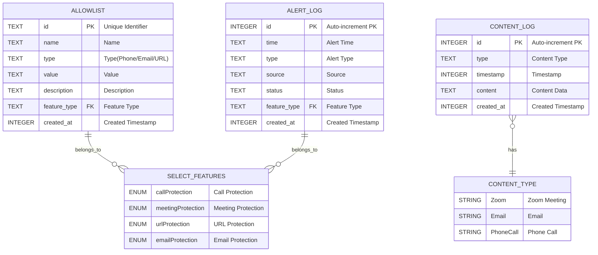
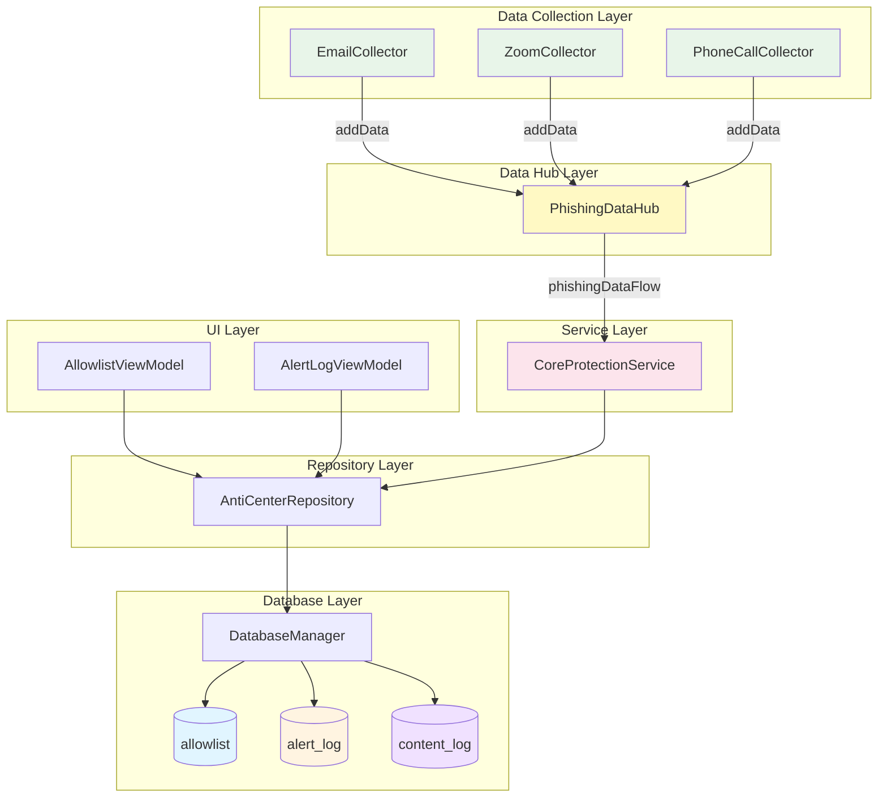
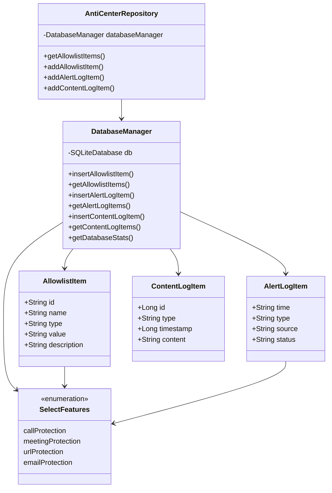

# AntiCenter Database ER Diagram

## Database Overview

- **Database Name**: anticenter.db
- **Database Version**: 2
- **Database Type**: SQLite
- **Manager Class**: DatabaseManager

---

## ER Diagram (Mermaid)



---

## Detailed Table Structures

### 1. ALLOWLIST (Allowlist Table)

| Field | Type | Constraint | Description |
|--------|------|------|------|
| id | TEXT | PRIMARY KEY | Unique identifier |
| name | TEXT | NOT NULL | Name |
| type | TEXT | NOT NULL | Type (Phone/Email/URL) |
| value | TEXT | NOT NULL | Actual value (phone number/email address/URL) |
| description | TEXT | - | Description |
| feature_type | TEXT | NOT NULL, FK | Feature type (linked to SelectFeatures) |
| created_at | INTEGER | NOT NULL | Created timestamp (milliseconds) |

**Indexes:**

- `idx_allowlist_feature_type` ON `feature_type`

**Relations:**

- `feature_type` → `SelectFeatures` (callProtection, meetingProtection, urlProtection, emailProtection)

---

### 2. ALERT_LOG (Alert Log Table)

| Field | Type | Constraint | Description |
|--------|------|------|------|
| id | INTEGER | PRIMARY KEY AUTOINCREMENT | Auto-increment primary key |
| time | TEXT | NOT NULL | Alert time |
| type | TEXT | NOT NULL | Alert type |
| source | TEXT | NOT NULL | Source |
| status | TEXT | NOT NULL | Status |
| feature_type | TEXT | NOT NULL, FK | Feature type (linked to SelectFeatures) |
| created_at | INTEGER | NOT NULL | Created timestamp (milliseconds) |

**Indexes:**

- `idx_alert_log_feature_type` ON `feature_type`

**Relations:**

- `feature_type` → `SelectFeatures` (callProtection, meetingProtection, urlProtection, emailProtection)

---

### 3. CONTENT_LOG (Content Log Table)

| Field | Type | Constraint | Description |
|--------|------|------|------|
| id | INTEGER | PRIMARY KEY AUTOINCREMENT | Auto-increment primary key |
| type | TEXT | NOT NULL | Content type (Zoom/Email/PhoneCall etc.) |
| timestamp | INTEGER | NOT NULL | Timestamp (milliseconds) |
| content | TEXT | NOT NULL | Content data (JSON or text) |
| created_at | INTEGER | NOT NULL | Created timestamp (milliseconds) |

**Indexes:**

- `idx_content_log_type` ON `type`
- `idx_content_log_timestamp` ON `timestamp`

**Relations:**

- `type` → Data source type (string type, not foreign key)

---

## Relationships

### One-to-Many Relationships

```text
SelectFeatures (1) ←→ (N) ALLOWLIST
  ├── callProtection    → Multiple allowlist records
  ├── meetingProtection → Multiple allowlist records
  ├── urlProtection     → Multiple allowlist records
  └── emailProtection   → Multiple allowlist records

SelectFeatures (1) ←→ (N) ALERT_LOG
  ├── callProtection    → Multiple alert log records
  ├── meetingProtection → Multiple alert log records
  ├── urlProtection     → Multiple alert log records
  └── emailProtection   → Multiple alert log records

ContentType (1) ←→ (N) CONTENT_LOG
  ├── Zoom      → Multiple content log records
  ├── Email     → Multiple content log records
  └── PhoneCall → Multiple content log records
```

---

## Data Flow Diagram



---

## Feature Type Enumeration (SelectFeatures)

```kotlin
enum class SelectFeatures {
    callProtection,        // Call Protection
    meetingProtection,     // Meeting Protection
    urlProtection,         // URL Protection
    emailProtection        // Email Protection
}
```

This enumeration serves as the logical foreign key for the `allowlist` and `alert_log` tables.

---

## Architecture Layers Explanation

### 1. Data Collection Layer
- **Purpose**: Collect raw data from various sources
- **Components**: EmailCollector, ZoomCollector, PhoneCallCollector
- **Output**: Send collected data to PhishingDataHub

### 2. Data Hub Layer
- **Component**: PhishingDataHub (Singleton)
- **Purpose**: Central data distribution hub using Kotlin Flow
- **Functionality**: Receives data from collectors and emits via `phishingDataFlow` for consumption

### 3. Service Layer
- **Component**: CoreProtectionService
- **Purpose**: Subscribe to PhishingDataHub and process phishing data
- **Responsibilities**:
  - Convert PhishingData to AlertLogItem
  - Save content to content_log table
  - Save alerts to alert_log table
  - Trigger threat overlay banners

### 4. UI Layer
- **Components**: ViewModels (AllowlistViewModel, AlertLogViewModel)
- **Purpose**: Manage UI state and interact with Repository for CRUD operations

### 5. Repository Layer
- **Component**: AntiCenterRepository
- **Purpose**: Provide clean API with coroutine support for database operations

### 6. Database Layer
- **Component**: DatabaseManager
- **Purpose**: Handle low-level SQLite operations

<!--
### 7. API Layer
- **Components**: AntiCenterAPI (interface), AntiCenterAPIImpl (implementation)
- **Purpose**: Public API for external modules to interact with the database
- **Note**: Currently not in use
-->


---

## Data Model Mapping

| Database Table | Kotlin Data Class | Description |
|--------|--------------|------|
| allowlist | `AllowlistItem` | Allowlist item |
| alert_log | `AlertLogItem` | Alert log item |
| content_log | `ContentLogItem` | Content log item |

---

## Main CRUD Operations

### Allowlist Operations

- `insertAllowlistItem()` - Insert/replace allowlist item
- `getAllowlistItems()` - Query all allowlist items for specified feature
- `updateAllowlistItem()` - Update allowlist item
- `deleteAllowlistItem()` - Delete single allowlist item
- `isValueInAllowlist()` - Check if value exists in allowlist

### Alert Log Operations

- `insertAlertLogItem()` - Insert alert log
- `getAlertLogItems()` - Query alert logs (with pagination support)
- `getAlertLogCount()` - Get alert log count
- `cleanupOldAlertLogs()` - Clean up old logs

### Content Log Operations

- `insertContentLogItem()` - Insert content log
- `getContentLogItems()` - Query content logs (with pagination support)
- `searchContentLogItems()` - Search content logs
- `getContentLogCount()` - Get log count
- `cleanupOldContentLogs()` - Clean up old logs
- `deleteContentLogItem()` - Delete log item

---

## Database Version Upgrade History

| Version | Changes | Date |
|------|---------|------|
| v1 | Initial version: created allowlist and alert_log tables | - |
| v2 | Added content_log table and related indexes | Current |

---

## Performance Optimization

1. **Index Strategy**
   - Indexes on `feature_type` field (allowlist, alert_log)
   - Indexes on `type` and `timestamp` fields (content_log)

2. **Data Cleanup**
   - Periodically clean old alert_log data (keep latest 1000 records)
   - Periodically clean old content_log data (keep latest 1000 records)

3. **Batch Operations**
   - Use `CONFLICT_REPLACE` strategy for efficient insert/update

---

## Usage Examples

### Example 1: Add Allowlist Phone Number

```kotlin
val item = AllowlistItem(
    id = "phone_001",
    name = "Company Phone",
    type = "Phone",
    value = "13800138000",
    description = "Office Landline"
)
databaseManager.insertAllowlistItem(item, SelectFeatures.callProtection)
```

### Example 2: Record Alert Log

```kotlin
val alert = AlertLogItem(
    time = "2025-10-21 10:30:00",
    type = "suspicious_call",
    source = "13900139000",
    status = "blocked"
)
databaseManager.insertAlertLogItem(alert, SelectFeatures.callProtection)
```

### Example 3: Save Content Log

```kotlin
val content = ContentLogItem(
    type = "Email",
    timestamp = System.currentTimeMillis(),
    content = """{"subject":"Test Email","from":"test@example.com"}"""
)
databaseManager.insertContentLogItem(content)
```

---

## Database File Location

```text
/data/data/com.example.anticenter/databases/anticenter.db
```

---

## Architecture Diagram (UML Class Diagram Style)



---

**Generated Date**: October 21, 2025  
**Database Version**: 2  
**Document Version**: 1.0
