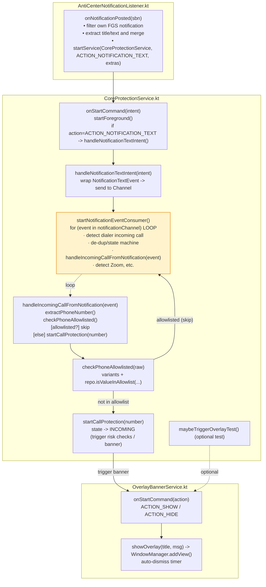

# Component Diagram (CoreProtectionService · NotificationListener · BannerService)

The diagram groups nodes by file and shows key functions and their relationships. It emphasizes the event loop inside CoreProtectionService that triggers protection and ultimately shows the banner.

Notes:

- The event loop lives in `startNotificationEventConsumer()` and consumes `Channel<NotificationTextEvent>`, which is the central trigger for protection features.
- Incoming call path: NotificationListener → CoreProtectionService (wraps event) → loop → extract number → allowlist check → if not allowlisted, enter protection and trigger `OverlayBannerService` to show a top banner.
- If allowlisted, the flow returns to the loop without starting protection or showing the banner.

